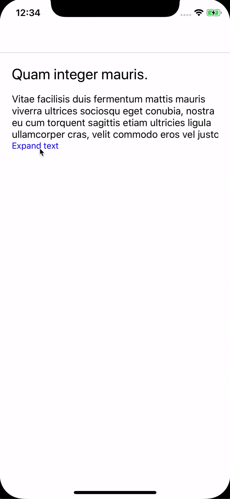

# React Native Expandable Text

[](https://npmjs.com/package/react-native-expandable-text)
[](https://tldrlegal.com/license/-isc-license)


[](https://travis-ci.com/mloureiro/react-native-expandable-text)
[](https://coveralls.io/github/mloureiro/react-native-expandable-text?branch=master)
[](https://www.codefactor.io/repository/github/mloureiro/react-native-expandable-text)

## Introduction

ExpandableText React Native component which allows to collapse and expand text. This was built to be very flexible but still lightweight.



There are already a few projects with the same propose, so why another one?

* **not opionated**:  a few of them have the text already in place, or must have the touchable render right after the text.
* **full control**: provides control API so that the dev uses as he needs
* **works with typography**: if you already have the typography based on the design system, and now have to duplicate all that can be collapsible it sucks, this component does NOT replace your text, only provides the required functionality
* **simply works**: doesn't matter how nested the text components are, the styles they use, the component take that into account.

## Installation

```bash
npm install --save @mloureiro/react-native-expandable-text
```

or 

```bash
yarn add @mloureiro/react-native-expandable-text
```

## Usage

#### API:

```typescript
interface Props {
  numberOfLines: number
  children: string | Text
  controller?: (ref: ExpandableTextInterface) => void
  onReady?: (prop: { isCollapsible: boolean }) => void
}

interface ExpandableTextInterface {
  collapse(): void
  expand(): void
  isCollapsed(): boolean
  isCollapsible(): boolean
  toggle(): void
}
```

#### Example

```typescript jsx
import React, { PureComponent } from 'react'
import { StyleSheet, Text, View } from 'react-native'
import { ExpandableText } from '@mloureiro/react-native-expandable-text'

export class MyComponent extends PureComponent<void> {
  private controller: ExpandableTextInterface;

  public render(): React.ReactNode {
    return (
      <View style={styles.container}>
        <ExpandableText
          controller={this.setController}
          numberOfLines={4} 
        >
          <Text style={styles.normalText}>
            {`Lorem Simpson perfectly cromulent highway 9 bird sanctuary`}
            <Text style={styles.superBigText}>
              {`the congealed group magumba ha ha! pollutinest `}
            </Text>
            {`everybody get naked don'ter doodily rappin' surfer snacktacular america junior `}
          </Text>
        </ExpandableText>

        <Text onPress={this.toggle} style={styles.toggler}>
          {'Toggle text'}
        </Text>
      </View>
    )
  }
  
  private setController = (controller: ExpandableTextInterface): void => {
    this.controller = controller; 
  }
  
  private toggle = (): void => {
    this.controller.toggle()
  }
}

const styles = StyleSheet.create({
  container: {
    flex: 1,
    padding: 20,
  },
  normalText: { fontSize: 12 },
  superBigText: { fontSize: 36 },
  toggler: { color: 'blue' },
})
```

